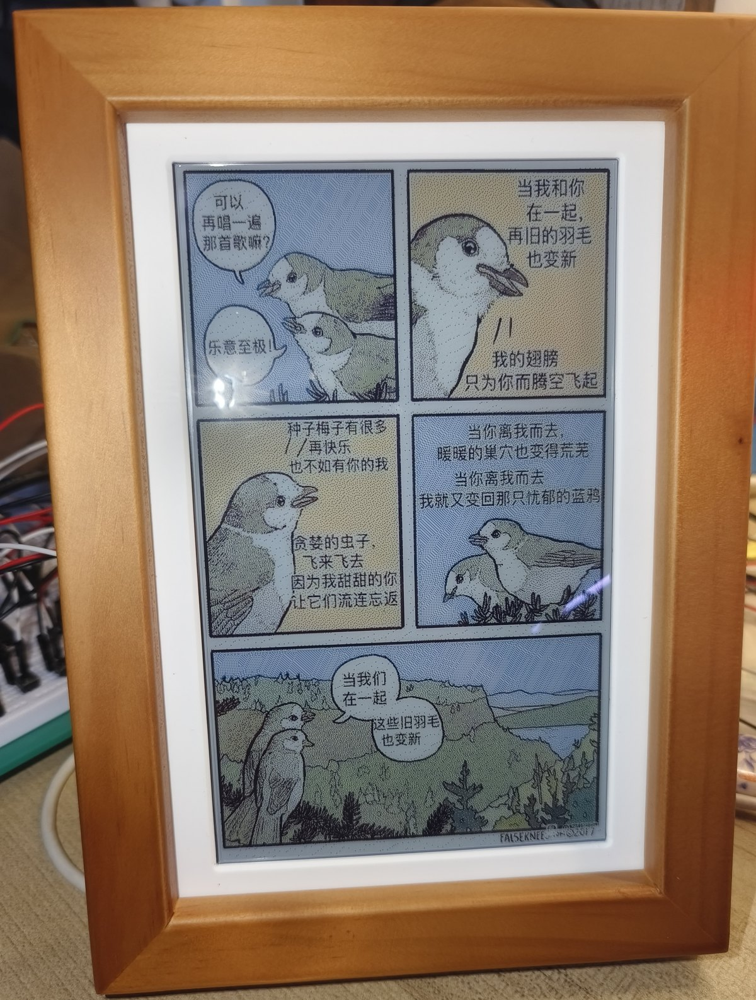
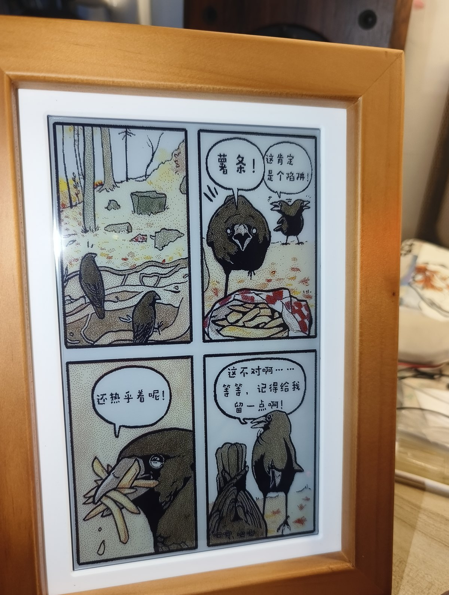
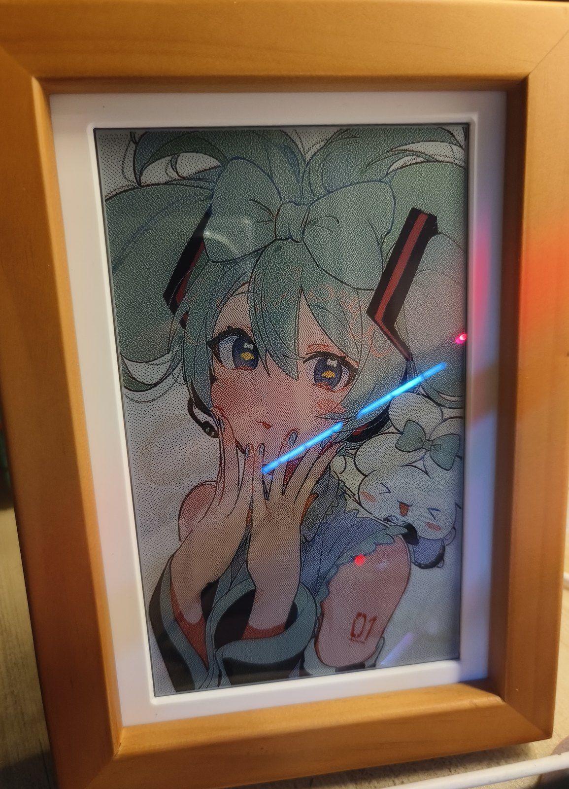

# ESP32-S3 PhotoPainter

一个围绕 **Waveshare 7.3 寸 Spectra 6 六色墨水屏相框** 的个人工作区：包含相框固件、
PC 端 AI 选片/渲染工具，以及若干配套的离线转换与调试工具。

> 墨水屏支持 6 色（黑 / 白 / 黄 / 红 / 蓝 / 绿），800×480。核心思路是
> **图片处理全部在 PC 或浏览器端完成**（缩放 + 抖动成 6 色 BMP），
> ESP32 端只负责写 SD 卡 + 刷新墨水屏，从而不占用 MCU 算力。

## 实拍

|  |  |  |
|:--:|:--:|:--:|
|  |  |  |

<sub>6 色墨水屏无背光、断电保持画面；图片经 6 色抖动后由仪表盘或 PC 端工具推送到相框。</sub>

---

## 仓库内容

| 目录 / 文件 | 说明 |
|-------------|------|
| `ESP32-S3-6Color-PhotoFrame/` | **相框固件**（ESP-IDF）。基于 [xiaozhi-esp32](https://github.com/78/xiaozhi-esp32) 修改，集成小智 AI 语音；含 SD 卡轮播、分类目录、顺序/倒序/随机轮播、WiFi 配网 + Web 仪表盘（上传/调色/推送）、低电量提示页、中文电量页。详见该目录 `README.md` |
| `AI-Photo-Picker/` | **PC 端 AI 选片工具**（Python）。用 VLM 给整本相册打分写文案 → 按"历史上的今天"选片 → 渲染 6 色 BMP → 推送到相框。详见该目录 `README.md` |
| `ConverTo6c_bmp-7.3/` | 离线图片转换工具：把任意图片转成墨水屏可用的 6 色 BMP（`convert.py`）。原先随附的 Windows/Mac **预编译二进制已移出仓库**——它们没有许可声明，再分发存在风险 |
| `开发日志.md` | 开发日志：记录遇到的问题、根因与解决方案（墨水屏点阵字库、FAT32 目录顺序、lwIP 套接字耗尽等踩坑记录） |
| `compare.html` / `scale-preview.html` | 浏览器端调试工具：抖动/调色管线对比、缩放模式预览 |
| `CLAUDE.md` | 本仓库使用的 AI 辅助开发约定（面向开发者/工具，可忽略） |
| `参考/` | 两个参考项目的 gitlink 指针（InkTime、微雪官方新版源码），**未随仓库分发**，克隆后为空目录 |

---

## 硬件

| 组件 | 型号 |
|------|------|
| 主控 | ESP32-S3，16 MB Flash，8 MB Octal PSRAM |
| 屏幕 | Waveshare 7.3" Spectra 6 墨水屏（GDEP073E01，800×480，6 色） |
| 音频 | ES8311（DAC）+ ES7210（ADC），I2S |
| 电源管理 | AXP2101（I2C） |
| 温湿度 | SHTC3（I2C） |
| 存储 | Micro SD 卡（SDMMC） |

## 快速开始

**不想装 ESP-IDF 的话**，直接去 [Releases](https://github.com/qian2023qian/esp32-s3-photo-painter/releases) 下载预编译固件，见下方 [下载与刷写](#下载与刷写)。

自行编译固件（需要 ESP-IDF v5.5.x，目标 `esp32s3`，开发板 `waveshare-s3-PhotoPainter`）：

```powershell
cd ESP32-S3-6Color-PhotoFrame
.\build_demo.ps1          # 或先加载 IDF 环境后 idf.py build
idf.py -p COMx flash monitor
```

上电后默认进入相框模式并轮播 `/sdcard/photos/` 下的图片；手机连上设备热点
（AP：`PhotoFrame` / `12345678`）后访问 `http://192.168.4.1` 打开仪表盘即可配网和传图。

PC 端 AI 选片：

```bash
cd AI-Photo-Picker
pip install -r requirements.txt
python main.py analyze     # 用 VLM 扫描相册并评分
python main.py render      # 选"历史上的今天"渲染 6 色 BMP 并推送相框
python main.py serve       # 打开 WebUI 浏览/渲染/推送
```

---

## 下载与刷写

预编译固件在 [Releases](https://github.com/qian2023qian/esp32-s3-photo-painter/releases)：

| 文件 | 用途 | 烧录偏移 |
|------|------|----------|
| `ESP32-S3-PhotoPainter-v2.0.1-merged.bin` | 单文件镜像（bootloader + 分区表 + 应用），**首次刷写用** | `0x0` |
| `ESP32-S3-PhotoPainter-v2.0.1-app.bin` | 仅应用，用于升级 | `0x20000` |

```bash
# 首次刷写（单文件，一条命令搞定）
esptool.py --chip esp32s3 -b 460800 --before default_reset --after hard_reset \
  write_flash 0x0 ESP32-S3-PhotoPainter-v2.0.1-merged.bin
```

> ⚠️ 单文件镜像从 `0x0` 写入，会**覆盖 NVS 分区**（`0x9000`）→ WiFi 凭据与相框设置被清空，
> 相当于恢复出厂设置。只想升级应用、保留设置的话，请把 `…-app.bin` 烧到 `0x20000`。

也可以用乐鑫的 Flash Download Tool：芯片选 **ESP32-S3**、Flash **16MB**、**DIO**、**80MHz**，把合并镜像下载到 `0x0`。

**SD 卡准备**

- 格式化为 **FAT32**。
- 相框模式：图片放 `/sdcard/photos/`（可再建一级分类目录），首次为空时墨水屏会显示提示页。
- 小智模式的天气页还需要 `/sdcard/01_sys_init_img/` 下的初始图与天气图标，
  **本仓库未附带**这些素材（它们来自微雪官方资料，请自行获取）。

---

## 许可

本仓库自有代码以 **MIT** 许可发布，见 [`LICENSE`](LICENSE)。

仓库内含**第三方开源代码的衍生作品**（`ESP32-S3-6Color-PhotoFrame/` 源自 xiaozhi-esp32，
`AI-Photo-Picker/` 源自另一个 MIT 项目），它们各自保留原有版权与许可声明，**不**被重新授权；
另有若干第三方组件与数据集（ESP-IDF、LVGL、XPowersLib、GeoNames 城市数据等）遵循其自身许可。
完整清单见 [`NOTICE.md`](NOTICE.md)。
