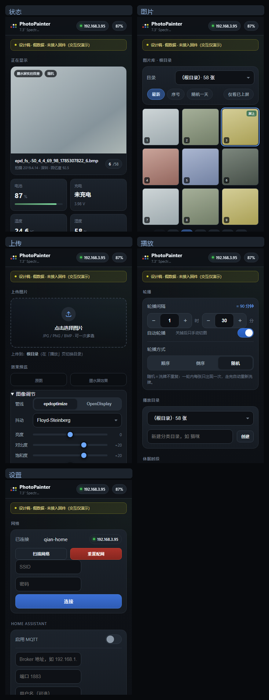

# WebUI 重设计（设计稿）

`webui-mockup.html` —— **单文件、自包含、无需构建**，双击即可在浏览器打开。
本目录只放设计稿，**还没有动固件源码**。

## 怎么用

- 直接打开 `webui-mockup.html`
- 底部 5 个页签可点击切换；也可以用锚点直达某一页：
  `#p-status` `#p-photos` `#p-upload` `#p-play` `#p-settings`
- **窄屏自检**（把"有没有横向溢出"变成可测量项，而不是靠肉眼）：
  `webui-mockup.html?w=360&measure=1#p-upload` 会把右边界超出界面宽度的元素列在页面顶部。

  已验证 **360 / 390 / 430** 三档宽度 × 5 个页面，`overflowCount` 全为 **0**。
  （过程中确实抓到一个真实 bug：grid 子项默认 `min-width:auto`，导致批量上传列表在
  360px 下溢出 29px；已统一改为 `minmax(0,1fr)` 修掉。）

## 设计取向

- **移动端优先**：真实场景是手机连热点传图，所以按手机单列布局设计，用**底部 5 页签**
  取代现在"一长条需要不停滚"的页面。
- **触控友好**：可点区域 ≥44px；调节项用滑杆，"时 / 分"用**步进器**（左右各一个 ±，
  用户不用敲冒号，点开就是数字键盘）。
- **识别色取自墨水屏本身**：黑 / 白 / 黄 / 红 / 蓝 / 绿 作为点缀（顶栏 logo、状态色），
  而不是默认的通用蓝紫配色。
- **信息分层**：状态页首屏回答"现在在显示什么"；上传页首屏是拖放区 + 原图/墨屏效果对比；
  设置类内容收进"播放"和"设置"两个页签，不再和图片列表挤在一起。
- **不用 CDN / 不引外部资源**：配网热点没有外网，页面必须完全自包含。
  纯手写 CSS（无框架），也没有外链图片——缩略图用 CSS 抖动纹理模拟墨水屏观感。

## 关于体积（重要）

- 本设计稿 **38 KB**，与现版仪表盘（44 KB）量级相当。
- 但**体积并不是硬约束**：`partitions/v2/16m.csv` 里的 `assets`（SPIFFS，7552 KB）
  因 `CONFIG_FLASH_NONE_ASSETS=y` **从未被烧写、也没挂载**；把它缩小（或去掉）之后，
  两个 OTA 槽各自可以扩到 **~7.4 MB**（当前各 4352 KB）。
  也就是说 100~300 KB 的 HTML 完全放得下。
- **唯一与体积无关、必须保留的约束：不能上 CDN**（无外网）。

## 与固件的对应（便于日后移植）

设计稿刻意**沿用固件里已有的元素 id**，移植时基本是"换皮 + 接线"：

| 设计稿元素 | 固件现有 id | 接口 |
|---|---|---|
| 顶栏电量 | `batt-tag` / `batt-volt` / `batt-chg` | `GET /api/status` |
| 当前显示 hero | `preview-processed` | `GET /api/photo?name=…&thumb=1` |
| 图片网格 | `photo-list` | `GET /api/photos`（`?reload=1` 重扫） |
| 目录选择 / 新建目录 | `set-dir` / `new-dir` | `GET /api/dirs`、`POST /api/mkdir` |
| 轮播方式 | `set-mode` | `POST /api/settings {mode}`（0/1/2） |
| 轮播间隔（时 / 分） | `set-interval-h` / `set-interval-m` | `POST /api/settings {interval}`（**分钟**） |
| 自动轮播 | `set-running` | `POST /api/settings {running}` |
| 休眠时段 | `set-sleep-start` / `set-sleep-end` | `POST /api/settings` |
| 上传 / 调色 | `file-input`、`adj-*` | `POST /api/upload?name=…&show=` |
| WiFi 配网 | `wifi-ssid` / `wifi-pass` / `ssid-list` | `GET /api/wifi/scan`、`POST /api/wifi/*` |
| MQTT | `set-mqtt-*` | `POST /api/settings {mqtt}` |
| 重启 | — | `POST /api/reboot` |

## 尚未做

- **未接后端**，全部是假数据；页签切换、开关、分段控件、步进器、底部弹层只是**演示交互**。
- 未做浅色主题（CSS 变量已就绪，补一套 `prefers-color-scheme` 即可）。
- 未做"本次上传"的失败重试、图片多选批量操作、缩略图懒加载占位。
- 顶部的"设计稿 · 假数据"提示条在正式移植时**要删掉**。
- 未实测 ESP32 端：HTML 传输耗时（AP 下 38 KB 约 1 秒内）、缩略图串行加载节奏。

## 建议的下一步

1. **先定稿设计**（配色 / 布局 / 文案你过一遍），改这里就行，不动固件。
2. 再把 `components/user_app_bsp/mode_src/dashboard.html` 换成新结构
   （`html_to_header.py` → `photo_web_pages.h` 的构建流程保持不变；
   注意改完要确认 `photo_web_server.cpp` 被重新编译，见固件 README 的构建说明）。
3. 若 HTML 明显变大，顺手缩 `assets` 分区、扩 `ota_0` / `ota_1`。
4. 实机校验：热点下手机打开、缩略图加载、批量上传进度、长按多选。
