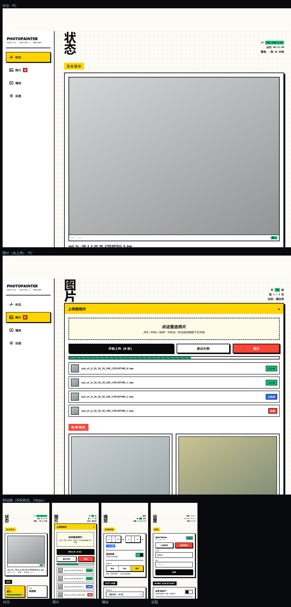
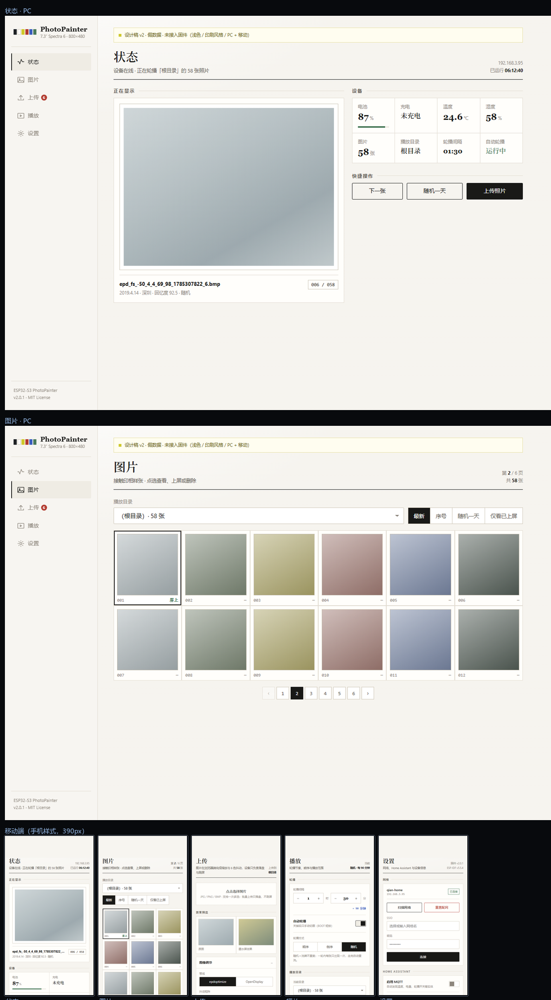

# WebUI 重设计（设计稿）

本目录只放设计稿，**没有改动任何固件源码**。

| 文件 | 风格 | 说明 |
|------|------|------|
| **`v3-brutal.html`** | **新粗野主义（大胆）** | PC / 平板 / 手机三档响应式 |
| `v2-light-print.html` | 纸张 / 印刷（浅色克制） | 同上，同一套信息架构 |
| `v2-preview.png` / `v3-preview.png` | — | 各自预览：PC（状态 / 图片）+ 手机四页 |

> 早期的 v1（深色、仅移动端）已按要求删除。

单文件、自包含、无需构建，**双击即开**。

## 信息架构（v2 / v3 一致）

按反馈把「图片」与「上传」**合并为一页**，4 个页签：

```
状态 · 图片（含上传）· 播放 · 设置
```

合并后的「图片」页从上到下：**上传面板**（可折叠）→ 目录/筛选 → 照片网格 → 分页。
上传完成后**就地刷新下方列表并高亮新增项**（网格里标「新」），不用再切页去看结果。

## v3：新粗野主义（大胆版）



刻意夸张，和 v2 是完全不同的气质：

| 元素 | 做法 |
|------|------|
| 边框 / 投影 | **3px 纯黑边框 + 硬投影**（`6px 6px 0`，无模糊），按下时按钮"塌陷"（位移 + 投影归零） |
| 配色 | 满饱和的墨水屏六色当色块用（黄 `#ffd400`、红 `#ff4438`、蓝 `#2f6bff`、绿 `#19c37d`） |
| 底色 | 暖白 + **方格纸网格**，呼应"仪表"感 |
| 标题 | 900 字重、超大字号的竖排大字（`状 / 态`），`clamp()` 自适应 |
| 章节标签 | 黑底白字 / 黄底黑字的**反白标签块**，不走小标题那套 |
| 色标 | 顶部一条六色"封箱胶带" |
| 状态 | 印章式贴纸（`已上传` / `上传中` / `失败` / `新`） |
| 数值 | 900 字重大数字 + 描边进度条（条纹填充） |

## v2：纸张 / 印刷（浅色克制）



暖白纸底、**衬线标题**、**发丝线网格**代替圆角卡片与阴影、数据用"规格表"排版、
作品像**展签**、图片列表像**接触印相样张**。六色做成印刷色标。

## 响应式（两版一致）

同一份 HTML，只靠媒体查询切换导航形态与列数：

| 断点 | 版式 |
|------|------|
| **≥1024px（PC）** | 左侧栏导航**贴左边（全出血）**；内容在右侧剩余区域里**定宽居中**（v2 1120 / v3 1160），不随窗口拉伸；状态页两栏；图片 6 列；设置两栏 |
| **641–1023px（平板）** | 顶部横向导航；图片 4~5 列 |
| **<641px（手机）** | **底部页签**；单列；图片 2~3 列；时/分步进器整行两个大控件 |

## 自检与实测

两版都内置：`?measure=1` 把"右边界超出参考宽度"的元素列在页面顶部（带类名与尺寸）；
`?w=NNN` 用于模拟指定宽度（绕开无头浏览器 ~496px 的布局视口下限）。

| 版本 | 视口 | 结果 |
|------|------|------|
| v2 | PC 1374 / 平板 739 / 手机（492 视口手机样式 + 模拟 360）| `overflowCount=0`，无横向滚动 |
| v3 | 平板 739（`--dump-dom` 实测，4 页）| `overflowCount=0`，`bodyScrollWidth == 参考宽度` |
| v3 | PC 1400 / 手机 390 | 截图目视确认无裁切（截图工具在 measure 覆盖层上有时序怪癖，未取到数字） |

自检过程中抓到并修掉 3 个**真实 bug**（都是肉眼很难发现、真机会出横向滚动条的那类）：

1. **类名冲突**：v2 里照片网格与底部弹层都叫 `.sheet`，两条 CSS 规则互相污染
   （照片网格被套 `position:fixed`、弹层被套 `display:grid`），360px 下照片单元被撑到 477px。已改名 `.contact`。
2. **grid 列不可收缩**：v2 的 `.cols` 隐式列为 `auto`，子项 `min-content` 把整列撑到 375px
   （超出手机宽 15px）。改为显式 `minmax(0,1fr)` + 子项 `min-width:0`。
3. **网格容器错位**：v3 我在 `body` 里多插了顶部色标条，而桌面两栏网格是加在 `body` 上的，
   于是色标占了第 1 列、`main` 被挤进侧栏那条窄列 → **PC 端整页空白**。改为把网格放在内层 `.shell` 上。

## 与固件的对应（便于日后移植）

两版都**沿用固件里已有的元素 id**，移植基本是"换皮 + 接线"：

| 设计稿元素 | 固件现有 id | 接口 |
|---|---|---|
| 电量 / 温湿度 | `batt-tag` / `batt-volt` / `batt-chg` / `s-temp` / `s-rh` | `GET /api/status` |
| 正在显示 | `preview-processed` | `GET /api/photo?name=…&thumb=1` |
| 照片网格 | `photo-list` | `GET /api/photos`（`?reload=1` 重扫） |
| 目录 / 新建目录 | `set-dir` / `new-dir` | `GET /api/dirs`、`POST /api/mkdir` |
| 轮播方式 | `set-mode` | `POST /api/settings {mode}`（0/1/2） |
| 轮播间隔（时/分） | `set-interval-h` / `set-interval-m` | `POST /api/settings {interval}`（**分钟**） |
| 自动轮播 | `set-running` | `POST /api/settings {running}` |
| 休眠时段 | `set-sleep-start` / `set-sleep-end` | `POST /api/settings` |
| 上传 / 调色 | `file-input`、`adj-*` | `POST /api/upload?name=…&show=` |
| WiFi | `wifi-ssid` / `wifi-pass` / `ssid-list` | `/api/wifi/*` |
| MQTT | `set-mqtt-*` | `POST /api/settings {mqtt}` |
| 重启 | — | `POST /api/reboot` |

## 关于体积：不是硬约束

`partitions/v2/16m.csv` 里的 `assets`（SPIFFS，**7552 KB**）因 `CONFIG_FLASH_NONE_ASSETS=y`
**从未被烧写、也没挂载**。缩小它之后两个 OTA 槽各自可从 4352 KB 扩到 **~7.4 MB**。

**唯一与体积无关、必须保留的约束：不能上 CDN**（配网热点无外网，页面必须自包含）。

## 尚未做

- **未接后端**，全是假数据；页签、开关、分段、步进器、弹层只是**演示交互**
- 未做深色主题（v2 浅色 / v3 浅色；CSS 变量已集中，可再补一套）
- 未做上传失败逐项重试的完整交互、图片多选批量操作、缩略图懒加载占位
- 顶部"设计稿 · 假数据"提示条正式移植时**要删掉**
- 未实测设备端：HTML 传输耗时、缩略图串行加载、手机浏览器字体回退

## 建议的下一步

1. **在两版之间定一个方向**（或指定混合：比如 v3 的体量 + v2 的配色）
2. 再把 `components/user_app_bsp/mode_src/dashboard.html` 换成新结构 ——
   `html_to_header.py → photo_web_pages.h` 构建流程不变；
   **注意改完要确认 `photo_web_server.cpp` 真的被重新编译**（见固件 README 构建说明）
3. HTML 变大就顺手缩 `assets`、扩两个 OTA 槽
4. 实机校验：热点下手机/PC 打开、缩略图加载、批量上传进度、长按多选
